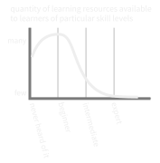

The Beginner Bubble
===================

## Introduction

The internet has made self-taught learning more accessible than ever before. I am a strong proponent of self-teaching and using the internet to learn about anything you're interested in. But, the nature of internet learning also has its drawbacks, one of which I'm deeming the beginner bubble.

I think many people have had the experience of discovering a super niche website written by a single, passionate person with an educational quality that puts textbooks to shame. Those kinds of websites are great, but they're hard to come by when you're intentionally looking for them. Outreach is hard for creators, and sifting through SEO and blogspam is hard for learners. Instead, we tend to compromise and use a common arena like Youtube instead of specialized websites and webrings. I would say that Youtube has become the de-facto home of internet learning in many ways, but it suffers greatly from the beginner bubble.

If I were to make a graph depicting the quantity of learning resources available to learners of different skill levels for a topic, which I have, then it would look like this, which it does:

There seems to be an endless supply of "for beginners", "intro to", and "how to get started with" tutorials online, and a very quick taper into obscurity beyond that. I am not saying that there are literally zero learning resources for advanced and expert learners, but take a quick dive into search queries like
[programming oop](https://www.youtube.com/results?search_query=programming+oop),
[git basics](https://www.youtube.com/results?search_query=git+basics), or
[learn hangul](https://www.youtube.com/results?search_query=learn+hangul)
and behold the open floodgates. Now, try again with
[advanced Python](https://www.youtube.com/results?search_query=advanced+python) (the first things I see on the page are "Overview of Python & How it Works", "Advanced Python 01 - lists / 02 - tuples", ...),
[advanced Korean grammar](https://www.youtube.com/results?search_query=advanced+korean+grammar) (notice, it's still mostly vocab lists or unhelpful vlogs).
Higher level learning materials exist, but the number of beginner lessons is so totally dwarfing as to get my attention and provoke this article.

## Why - generous interpretation

Let's start by giving everyone the benefit of the doubt.

**Never heard of it**: Any topic worth teaching will have some level of pre-requisite knowledge. It is difficult to give a meaningful lesson on Python to someone who doesn't know the basic concept of programming -- it will devolve into a lesson on the basic concept of programming that just so happens to be demonstrated in Python. This prerequisite chain continues down to "what is a computer" and so on. So, creating lessons for *Never heard of it*s is difficult because the creator must assume some level of background knowledge, and every creator may pick a different threshold. By virtue of creating a "Basics of Python, lesson 1", the creator inherently skips over people who have never heard of programming. That's not a bad thing, because nobody on the internet is obligated to create something they don't want to, and most likely there are others out there who will teach the basics of programming.

Not to mention, learners won't be seeking out learning material for topics they've *literally* never heard of. In order to access that demographic, the creator either has to present basic lessons on many topics and gain a "general learning" or "pop science" subscriber base, or hope that by sharing and word of mouth their lessons will reach the people who will be interested.

**Beginner**: Beginner level resources are the most numerous because of multiple natural tendencies by both the learners and creators.

1. Learners don't need very specific information and will be happy with anything as long as it's appropriate for their skill level. Each individual creator will have a different idea as to what they should put in their "beginner level" lessons, and the learner will use material from several creators to eventually get a well-rounded beginner-level understanding.

2. Learners need some time to decide whether or not they want to pursue the field further. They are probably searching for beginner materials just test the waters. After that, learners either drop out or spend more time with hands-on learning, reducing the demand for more advanced tutorial content.

3. Creators will usually start their lesson series by teaching the basics, instead of going straight for the advanced topics. Though they may continue to create higher level material too, others will stop creating, so the quantity of beginner resources will be the largest of all categories by default. Again, no one has an obligation to create if they don't want to, so someone who tries making tutorials may find they don't want to continue, and that's ok.

4. Creators who create for the beginner level will all start out in roughly the same place, then later branch out to fulfill specific niches. There comes a point where "Intermediate lesson on topic X" would be better titled "Beginner lesson on more advanced topic Y". For example, a first lesson on machine learning might require intermediate programming skills, but is better described as "Basics of machine learning" than a clumsy "Using intermediate programming to do machine learning". Learning materials will have a tendency to describe themselves as the basics of something rather than the intermediates of something. Thus, the bubble is partly a result of labeling.

**Intermediate**: I was careful to title the graph using the phrase "available to" and not "made for", because ultimately no matter how much content is made on the internet, discoverability and searchability is a critical factor in actually reaching anybody. One reason Intermediate material availability is low is that at this level, learning materials are specific enough, and require domain-specific keywords, that simply searching for "intermediate X tutorials" probably won't help the learner find what they're looking for. Any resources that are titled so simply probably contain a smattering of information bordering on beginner-intermediate but without the depth and specificity the learner actually wants. Learners must know some keywords to access what they need, which is difficult when you don't know what you don't know.

**Expert**: In addition to the searchability issue, the supply of expert-level lessons is low simply because the demand is low. Experts don't need lessons because they grow through actual experience and they know how to learn from source-level material. An expert programmer doesn't need tutorials on how to use a library because they can read the documentation or source code. An expert artist doesn't need more drawing lessons because they can establish their own style and innovate new techniques.

## Why - critical interpretation

It's time to get critical of the situation, because I've noticed behaviors and patterns from creators that don't line up with the generous interpretation. Although the beginner bubble is the observable, physical product of creator behavior, I feel that creator behavior itself can often be described as a beginner [tar pit](https://en.wikipedia.org/wiki/Tar_pit). From the point of view of an internet creator with less-than-noble goals, it is best if the audience remains stuck at the beginner level.

To start with, I accept the fact that the beginner audience is simply the largest audience. I believe what I said about learners and creators dropping out, and learners not needing as many tutorials as they advance. There's nothing wrong with that being true. I don't think the resource graph should be flat. However, I've noticed some creators who stay in the beginner bubble far longer than necessary. I find myself trying to assess whether the creator is genuinely passionate about teaching their subject and helping learners advance their skills, or whether they just make lessons for youtube views, ad dollars, book sales, course sales, etc.

The bubble continues to balloon, because:

**Anyone can do it**: The barrier to entry for publishing online is getting lower and lower. Overall, that's a good thing, but it also means that creators can start teaching before they are anything more than a beginner themselves. Some people are just a little too eager to start explaining things to others, and during their second week of learning about a topic will happily make tutorials for everything they learned in their first week. At this stage, the creator lacks the big picture context that would allow them to make smart decisions about what to teach or omit. Their lessons will be regurgitations of whatever lessons they've received, without understanding how the information actually pieces together. I have had to resist this urge many times, and I've failed many others.

**Those who can, do**: And those who can't, talk about doing. The only people capable of creating expert-level teaching material are the experts, and where are they? They're out practicing their craft, of course; continuing to hone their skills and furthering their career doing what they're an expert at. Real experts don't have as much time to faff about with internet tutorials as people who like to pretend that they're experts.

**They can sell you stuff**: Not only are beginners the largest demographic, they are disproportionately more willing to spend on resources than learners at higher skill levels. This is partly because they haven't reached the moment of disillusionment that learning requires significant time and effort and not just the buying of books, and partly because they cannot yet assess the quality of the resource being sold to them. If a beginner buys a low quality resource that's difficult to learn from, they might think the topic is just hard. Higher level learners will have better BS detectors and less patience for low quality material.

Scammers around the world prey on the ignorant, and "educational" scammers are no different. You can find videos online of magical polyglots spitting phrases in a dozen languages they supposedly learned to fluency in six months each. And for just $14.99, you can have access to their course showing how they got there.

Here's a quote I discovered on [hn](https://news.ycombinator.com/item?id=23451264) which is half relevant and all poignant:

> Writing for money and reservation of copyright are, at bottom, the ruin of literature. No one writes anything that is worth writing, unless he writes entirely for the sake of his subject. What an inestimable boon it would be, if in every branch of literature there were only a few books, but those excellent! This can never happen, as long as money is to be made by writing. It seems as though the money lay under a curse; for every author degenerates as soon as he begins to put pen to paper in any way for the sake of gain. The best works of the greatest men all come from the time when they had to write for nothing or for very little.

> If the reader wishes to study any subject, let him beware of rushing to the newest books upon it, and confining his attention to them alone, under the notion that science is always advancing, and that the old books have been drawn upon in the writing of the new. They have been drawn upon, it is true; but how? The writer of the new book often does not understand the old books thoroughly, and yet he is unwilling to take their exact words; so he bungles them, and says in his own bad way that which has been said very much better and more clearly by the old writers, who wrote from their own lively knowledge of the subject

> Arthur Schopenhauer, "On Authorship"

**Immunity to criticism**: Resources for beginners will naturally need to smooth over some details to keep the lesson understandable, but that becomes decreasingly acceptable as you reach expert level materials. Creators who can't teach the fine details or don't want to deal with criticism will find safety in the beginner tar pit. As long as the lesson is labeled as "for beginners", then it becomes immune to any criticisms that details are missing, edge cases aren't covered, specifics are left vague, and examples feel artificial. You'll hear "*I know I skipped over that, I just wanted to keep it simple*".

Not only are beginner resources more immune to criticism, but they attract less criticism in the first place since the audience, by design, consists of people who know little on the subject. It doesn't matter if the magical polyglot horribly mangles the pronunciation of their dozen languages if the listener doesn't know the right pronunciation either. You don't have to be very skilled to impress at this level, which feels good for the creator.

**I'm different**: I know I'm a jerk for raining on people's parades, but as I swim through a seemingly endless supply of Lesson Ones, it's clear to me that the majority of creators on the internet are fantastically, myopically unaware of just how many people have already beat them to the punch, or just don't care. It is somewhat mind boggling to me that people don't stop to think "I wonder if anyone else has already made a tutorial about this" before making their own and tossing it onto the mountainous heap. Or they do think about it, but decide that their version is somehow different and special. More realistically, they didn't actually look at what already exists, because they're here to be Mr Teacher, not to learn what's already out there.

Sure, again, we remind ourselves that anyone can make whatever they want. I'm going to stop adding that disclaimer now. It's true that teaching others is a great way to help oneself learn, so maybe a lot of it boils down to that. Still, it's fascinating to me from a sociology point of view that creators either don't consider or realize the oceanic scale of the internet, and the fact that their idea has probably already been done and done better [footnote_link]; or they do realize that but go ahead with it anyway.

Is it for ego, to have *their* name on the page and not someone else's? Is it for practice, to get comfortable writing and speaking and editing? Is it because they'd rather spend 3 hours making their own tutorial than 20 minutes reading another and just sharing that link? Do they genuinely think they bring something new to the table, even on basic and rote topics? But, wait a minute, none of these desires require that we stay in the tar pit -- couldn't we get the same ego boost and speaking practice and enjoyment of creation by making something besides another Lesson One? Something actually unique? [footnote_link] The answer is most obviously yes, and yet here we are. The number of collective man-hours spent spinning our wheels on remaking the same Lesson Ones is disappointing. I'm not asking for people to be robotic and completely deferential to the anonymous mass of the internet, with only one tutorial in the whole world for any given subject, but the situation has got my mind turning and I'm becoming increasingly self-aware about whether I'm being novel enough in what I publish.

When I am programming, I often find situations where there is an existing tool to do what I need, but I would rather have the enjoyment and control of making my own. This is surely similar, though I would note that I publish them without making any false gestures that I'm doing it for the benefit of some audience. I publish them because its free and easy and doesn't bother anyone else since my repos get no visitors anyway.

**Low commitment**: When it comes to beginner-level information, there's never a single correct order to present the many concepts. Knowledge is a web without a clear starting point. It is natural that a teacher will present many ideas which at first seem unrelated, and the connections become clear as the lessons progress. However, if the creator is not committed to helping learners grow their knowledge web, they have the option of instead continuously bouncing around their repertoire of beginner lessons without actually developing the connections. If the learner doesn't perceive the connections, and every lesson is presented to them as if it were novel, they may not realize they're being held in the tar pit when they could be advancing.

Contrast that with someone who shows, say, how to build a house from the ground up, or how to go [from Nand to Tetris](https://www.nand2tetris.org/). In those cases, there's a clear starting point (empty lot, nand) and a clear ending point (house, tetris), and if the creator doesn't reach the ending point it will be obvious to every onlooker. Abandonment and unfinished business is more apparent at the expert level. Creators who aren't confident or committed in their teaching can stay in the tar pit.

**Audience pull**: My tone in this section largely paints these beginner-level resource creators as malicious -- as intentionally trying to keep learners stuck in the tar pit for their own personal gain. And for the scammer types that's true, but I must clarify that some creators wind up staying in the tar pit without consciously choosing to. Take for example a creator who makes a couple of beginner lessons, then starts receiving comments and emails from learners requesting a lesson on some other beginner topic. Repeat a few times. The problem is that the collective intelligence of the requests never really rises because the audience churns and new beginners make new requests, and randos on the internet are very bad at using search bars for some reason, so they wind up requesting the same things over and over again. For the creator, it feels good to be getting recognition, and they'll want to please the crowd by fulfilling those requests, without putting their foot down about the direction they want to take their creation. Plus, again, beginners are the biggest audience, creating disproportional feedback towards beginner level topic requests.

[footnote_text] The brain has not yet become accustomed to the light which the internet has shone upon it: it's very, very hard to come up with anything original.

[footnote_text] inb4 this article is not unique either.

## Case studies

[Talk To Me In Korean](https://youtube.com/channel/UC5r3WHrX4Z7peSYpDlgktGw/videos) is the inspiration for this article. With over 1,600 videos already on the channel and some dozens of courses on the site, they continue to astound me by releasing videos like [How to make Korean sentences (for absolute beginners)](https://www.youtube.com/watch?v=TUSNTV7VkcI). In the past six months, they have greatly ramped up production on their "Live Korean Class" series, which are hour-long meanders through a general topic. The individual teaching moments that occur throughout the livestreams will of course be valuable to somebody, but with such low information density, searchability, and conciseness of theme, they are useless to someone serious about learning the language. These are for people who want to feel like they spent an hour studying, without putting in an hour's effort.

Every couple of weeks they publish a video reminding you to buy their books.

TTMIK's best product is undoubtedly Iyagi, a now-defunct podcast which totaled 145 episodes of pure, no-English, normal-speed Korean speech plus full transcripts. At one point, all the episodes were freely available and I downloaded them. Now they're behind a paywall, because TTMIK realized that their podcast from 8-10 years ago is of higher value than the hours and hours of video they make now. Their [old videos](https://www.youtube.com/watch?v=cP55GAFNCx8 "Princess Service") are pretty hilarious, too. As always, it's the business that spoiled the product.

[Duolingo](https://www.duolingo.com/) has a [reputation](https://old.reddit.com/r/languagelearning/search?q=duolingo&restrict_sr=on&include_over_18=on&sort=relevance&t=all) for people using it to study on a daily basis, sometimes for months or years, without making significant meaningful progress. Yes, we can blame the learners for only using a single resource, and only using it for a few minutes a day. But Duolingo's reputation in this regard far overshadows any similar examples I can think of. There's clearly something about Duolingo's formula that encourages the learner to feel as if they're being productive without actually helping them out of the bubble. Part of that comes down to their advertising, and part of it is their UI's positive tone and encouragement without reminders to study harder with other resources too.

Forgive me if I don't provide too many other case studies of bad examples. I don't actually want to bully individuals, and these days I don't read / watch enough tutorial content to know names of popular creators. TTMIK just brought it out of me. Let's share some positives instead.

[Thomas Frank](https://www.youtube.com/channel/UCG-KntY7aVnIGXYEBQvmBAQ) has created a respectable channel and I am happy for his success. Spreading the word about learning and motivation is nothing but a good thing. You can tell, though, that his video topics tend to repeat, probably partially as a result of fan requests. For a general topic like "college level studying" of course I expect everything to stay rather basic and widely applicable, but I think Frank's channel is a good example of the pressure to publish exceeding the number of new topics to explore in the space.

[GO! Billy Korean](https://youtube.com/channel/UC7ynjArlSFuXW23ssZAknyA/videos) is a great guy and I admire his passion for teaching. He usually doesn't get into highly advanced lessons, but he gets into intermediates with his language and culture trends videos. He even goes through the effort of cutting down his live 2-hour classes into 12-minute abridged versions, which I know for a fact is not a quick thing to do. His videos are straight to the point and he very, very rarely mentions his paid books or patreon. His primary lesson videos are short enough and well-titled. My only criticism is that he seems to have put a hold on his primary series of 113 episodes to start a new [beginner course](https://www.youtube.com/watch?v=uOlcIBtaplQ), which is a bit of a circle back into the tar pit.

[ultimateKOREAN](https://youtube.com/channel/UCgHxZ3lZwfxQcr-P6HuU7mA/videos) is a champion of lesson quality. How often do you see actual bibliographic citations in a youtube video description? Although the specific dialogues that he teaches with are often above my level, his explanations give me clear insight on what I should look out for as I continue to learn. He is careful to note that grammar taught in textbooks is not the same as grammar used in real life, and always presents multiple possible reasons why a certain grammar construction would be used. In the comments of [A deep look at 잖아](https://www.youtube.com/watch?v=Lzi1jzpT6XI), he says "I love doing this but at the same time I somewhat feel discouraged when other channels get more views for less informative content". Please show him your appreciation.

[Ben Krasnow aka Applied Science](https://youtube.com/channel/UCivA7_KLKWo43tFcCkFvydw/videos) doesn't make 'lessons' per se, but he is undeniably a natural teacher. Everything he does is filled with genuine interest and the utmost respect for the viewers. He knows exactly how to progress the viewer's understanding from Never Heard of It to a reasonable understanding (for a sub-30 minute video) without ever dumbing down the scientific terminology. When he's experimenting with something, he always points out room for improvement and possible future applications to stimulate the imagination.

[3Blue1Brown](https://youtube.com/channel/UCYO_jab_esuFRV4b17AJtAw/videos) makes animated math videos and [publishes the code he makes them with](https://github.com/3b1b/manim). His goal it to clear away the magical haze that blocks peoples' understanding of math by showing how complicated systems can be represented with clear, intuitive visuals. His lessons are awesome and he's awesome.

[Bill Hammack aka The Engineer Guy](https://youtube.com/channel/UC2bkHVIDjXS7sgrgjFtzOXQ/videos) is a clear communicator who shows the fascinating internals and design of things we take for granted, often with a poetic bent. It's hard to pick a single best video, so check out [Nitinol](https://www.youtube.com/watch?v=wI-qAxKJoSU), [Plastic injection molding](https://www.youtube.com/watch?v=RMjtmsr3CqA) and [Aluminum cans](https://www.youtube.com/watch?v=hUhisi2FBuw).

[Ian LaSpina aka Knyght Errant](https://youtube.com/channel/UC1T4KJG1L_kTrP9RcdU5Csw/videos) participates in Medieval Living History events and makes videos about medieval culture, arms, and armor. Although I never considered myself to be very interested in history, I was absolutely absorbed by his [Palazzo Ducale Bascinet video](https://www.youtube.com/watch?v=mSjmxMfEtvE) and quickly [binged](https://github.com/voussoir/ycdl#easily-watch-every-video-on-the-channel) his whole channel.

## Escape the bubble

To creators who are passionate about teaching: Know that there is an audience who desires higher level learning material. Know that a thoughtful and powerful lesson maintains its value and rewatchability for a long time, although the overall view count will be lower than the cheap stuff. Rewatching well-presented lessons is a pleasure in itself, and I frequently rewatch videos on the channels mentioned here just for fun. Know that as the creator, your channel is your ship to steer and you don't need to be pulled back by audience requests.

To creators who are passionate about making money: Nothing I can say will change your mind.

To learners: Recognize when you are being held in a tar pit. Diversify your learning sources so as to know the strengths and weaknesses of each. Encourage creators who do good work, because they need to hear your appreciation. Support them on patreon etc. if you want to go the extra mile.
